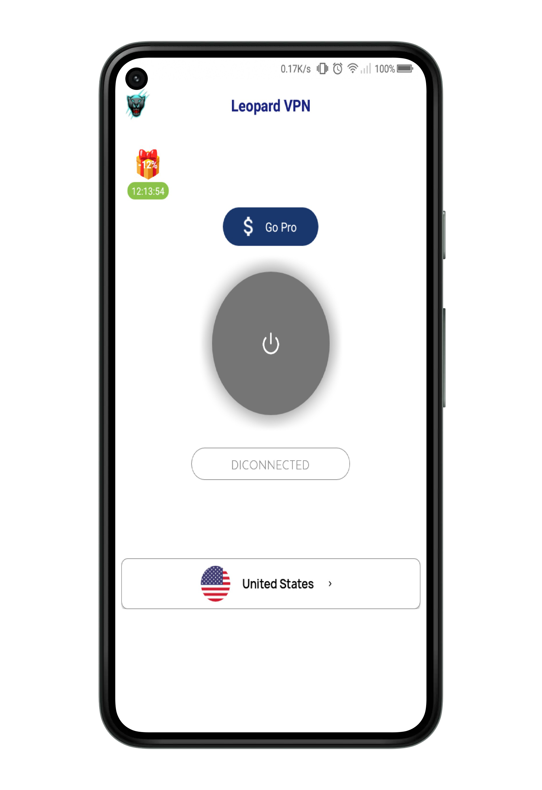

<br/>
<p align="center">
  <a href="https://github.com/SamiunNafis/leopard">
    
  </a>

  <h3 align="center">Leopard VPN </h3>

  <p align="center">
    Get secure and private access to the internet with Leopard VPN - the ultimate online security solution!
    <br/>
    <br/>
    <a href="https://github.com/SamiunNafis/leopard"><strong>Explore the docs »</strong></a>
    <br/>
    <br/>
    <a href="https://github.com/SamiunNafis/leopard/assets/apk/com.leopard.vpn_signed.apk">View Demo</a>
    •
    <a href="https://github.com/SamiunNafis/leopard/issues">Report Bug</a>
    •
    <a href="https://github.com/SamiunNafis/leopard/issues">Request Feature</a>
  </p>
</p>

    

## About The Project

 

Leopard VPN is a secure and reliable virtual private network (VPN) app that provides users with a secure connection to the internet. It is designed to protect users’ online privacy and security by encrypting their data and hiding their IP address. With Leopard VPN, users can access geo-restricted content, bypass censorship, and browse the web anonymously. It also offers a wide range of features such as unlimited bandwidth, unlimited server switching, and a kill switch to protect users’ data in case of a connection drop. Leopard VPN also offers a no-logs policy, meaning that no data is stored or shared with third parties. It is compatible with all major operating systems and devices, making it easy to use and set up. With Leopard VPN, users can enjoy a secure and private internet experience.

## Built With

The app Leopard VPN was built with Android Studio and the programming languages used are Java and XML. It was created with the intention of providing a secure and reliable connection for users. The app was developed using the latest technologies such as Firebase and JUnit. Java was used to create the core of the app, while XML was used to create the user interface. Firebase was used to store and manage data, while JUnit was used to test the app. All of these technologies were used to create a secure and reliable connection for users.

## Getting Started


### Prerequisites


* Android Studio


### Installation

Clone the repo

```sh
git clone https://github.com/SamiunNafis/leopard.git
```

### Build

``` sh
./gradlew build
```


## Authors

* **Samiun Nafis** - *Frontend Developer* - [Samiun Nafis](https://github.com/SamiunNafis/)
* **Melvin Jones Repol** - *Software Engineer* - [Melvin Jones Repol ](https://github.com/mrepol742)
